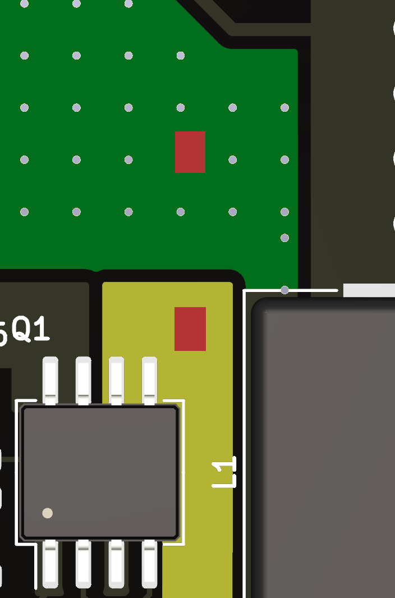
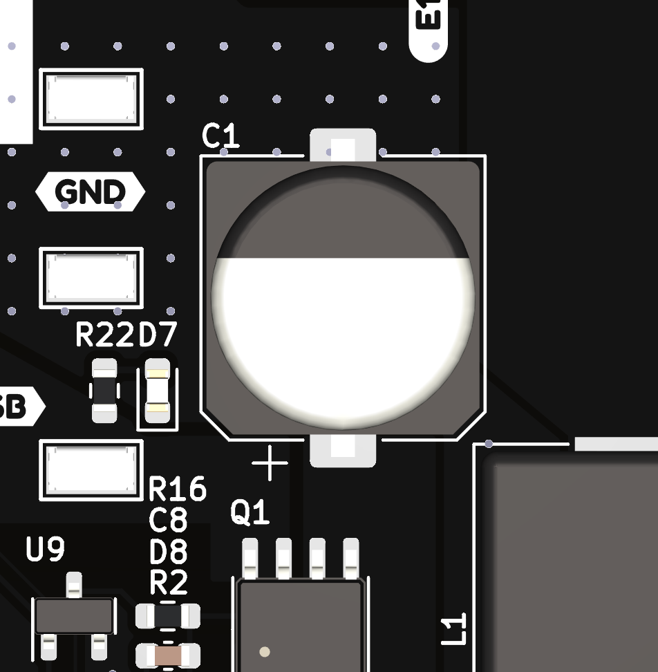
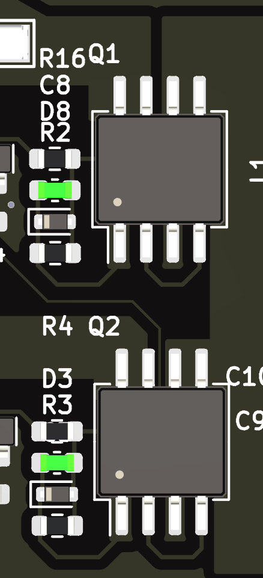
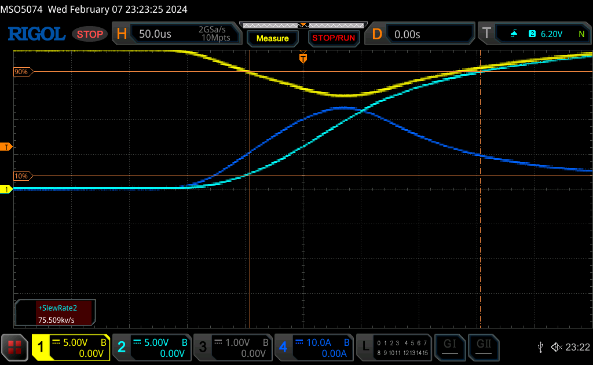
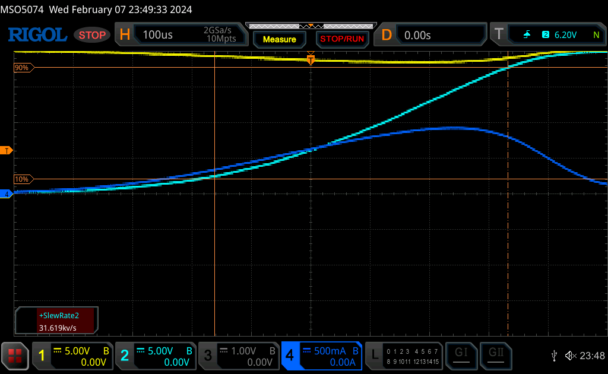
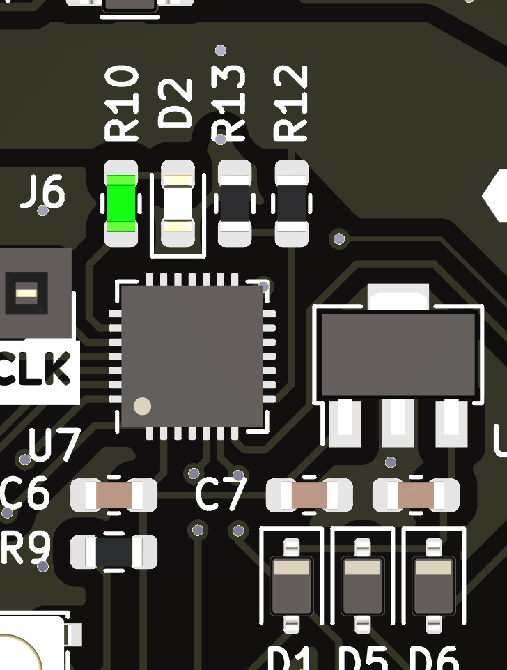
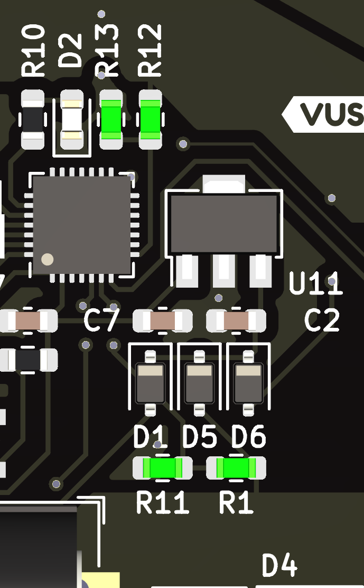
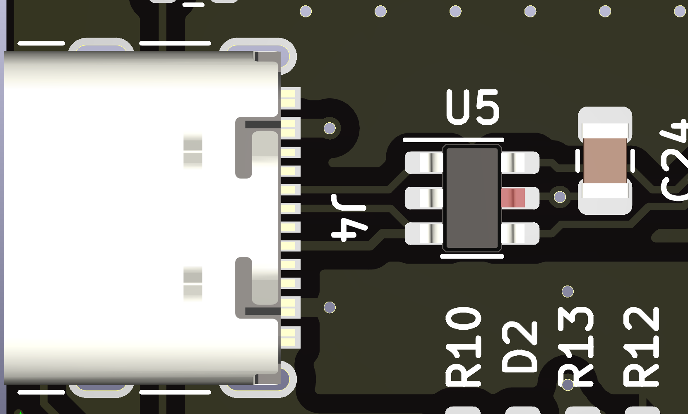
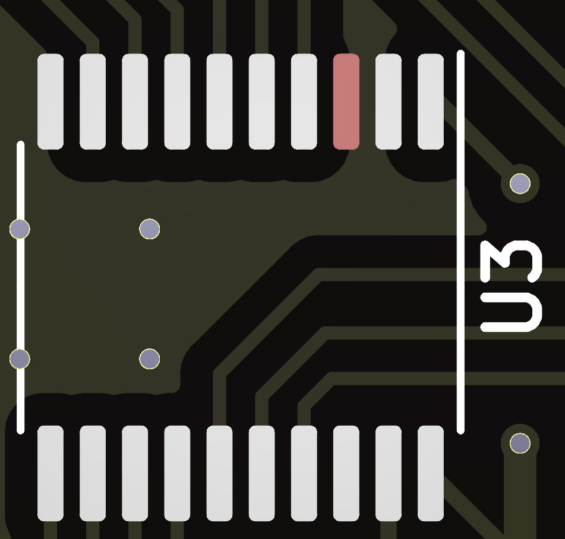
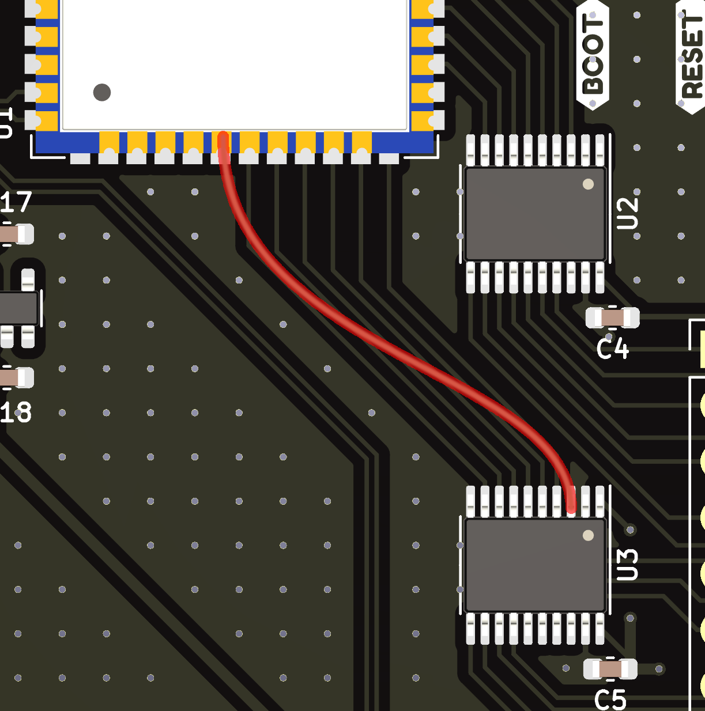

# A02 Rework guide

There's too many mistakes. Here's a summary of all the edits that need to be made. 

## Bulk Capacitance on Vin

Yep. Forgot bulk capacitance. Scrape off solder mask and add a 220uF/35V capacitor to Vin_Muxed to GND. Vin_Muxed is marked in yellow, and GND is marked in GND for reference. The suggested place to scrape off solder mask is marked in red.  

 

A01 PCB and edits to be made to add bulk capacitance

B01 PCB has bulk capacitor without need for edits

## High-Side Switch Slew-Rate limiting

In A01, some chargers would not deliver 20V when requested. This is because when the bulk capacitance was added, the inrush current would be too high. See the ~ 25A inrush when the high-side switch is turned on. The solution is modify C8 to be a [1uF Capacitor](https://product.samsungsem.com/mlcc/CL10A105KB8NNN.do). It is suggested to use a capacitor with a de-rated capacitance of 200nF at 15V DC Bias. C3 is also edited to have the same slew rate with the barrel jack power. 

C8 and C3 are highlighted to be edited to be a 1uF capacitor. 

A01 High-Side Switch turn-on transient. The large capacitance and fast turn-on causes a 25A inrush current and a significant voltage sag. 

- Yellow[1]: Vin_USB_C (V)
- Light Blue[2]: Vout_Muxed (V)
- Dark Blue[4]: Current In (A)

A02 High-Side Switch turn-on transient.  The larger capacitor on  the FET gates causes a slower slew rate, reducing the inrush current to be under 1A. 

- Yellow[1]: Vin_USB_C (V)
- Light Blue[2]: Vout_Muxed (V)
- Dark Blue[4]: Current In (A)

## CH32X035 LED Indicator Brightness

The LED is a bit bright. Edit R10 (highlighted below) to around 5K. 

## CH32X035 Voltage Sense 

The CH32X035 Arduino Library has no floating point divide instructions. The "solution" is to replace the low-side resistor (R13, R11) to be 3.3K and the high-side resistor (R12, R1) to be 18K. This ratio allows for `uint8_t Voltage = analogRead(VSensePin) >> 7` to be representative of the voltage being measured (within 1V or so), while not needing floating point division. 

## ESD Protection

The ESD protection diode has a clamp voltage of 5V. Since USB-C PD can go up to 20V, this may damage the ESD diode. To fix this, the VCC pin of the ESD diode must be disconnected from the VBUS of the USB port. Lift the red colored pin from the pad to disconnect it. 

## Logic Level Shifter pinout

The pinout is not right. Maybe 3AM layout will do that. On U3, mask off pin 3 so it's not connected to GND. This may be done with a small piece of kapton tape, liquid curable solder mask, or by lifting the pin high above the PCB. 

Next, jump that pin to IO12 of the ESP32-S3, shown below. 

