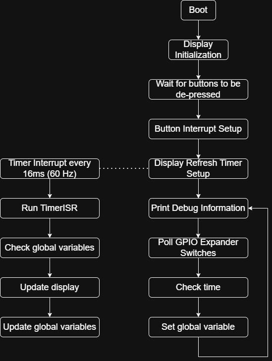

# 2.007 Spring 2025 Gameboard - Lever Display
This firmware is for the lever displays on the 2.007 Spring 2025 gameboard. The initial codebase is copied from the 2024 Button Displays.

One of the major changes in this firmware compared to most other code one might encounter is that everything is implemented in timer and interrupt peripherals. This means that the flow of the code is quite different from what most people learn when they first start writing code. [Here's a link](https://users.ece.utexas.edu/~valvano/Volume1/E-Book/C12_Interrupts.htm) to learn about interrupts.

Suggested flowchart for the firmware

The central flow diagram is what is typically taught in code structure. Here, initialization and setup code (usually in `void setup(){}`) is run once and code that repeats is run in a loop (usually in `void loop(){}`). What is special is the two other flow structures on the left and right. They get initialized in setup. 

Timers can trigger interrupts! Timer setups are a lot more hardware-dependent, so refer to the [ESP32 Arduino Framework documentation](https://espressif-docs.readthedocs-hosted.com/projects/arduino-esp32/en/latest/api/timer.html) on how to set up a timer. The timer in this case is set up to interrupt every 16ms, which equiates to about 60 Hz. Once the timer expires, `timerISR` is called, which updates the display. For more specific documentation on all the functions used to draw images to displays, see the dependent [ESP32-HUB75-MatrixPanel-DMA library](https://github.com/mrcodetastic/ESP32-HUB75-MatrixPanel-DMA).

For bitmaps, the `drawXBM565` function is called. This pulls a bitmap array from memory to draw it on the display. There's more documentation on this [here in the examples](https://github.com/mrcodetastic/ESP32-HUB75-MatrixPanel-DMA/tree/master/examples/BitmapIcons). In this firmware, all the image assets are saved in `ImageAssets.h` to clear up space in the main firmware file.

`LEDMatrixConfig.h` is used to define pins for various board revisions. It shouldn't need to be modified unless a new board revision is designed. 

For the 2025 gameboard, since there are 6 levers, it's recommended to poll an [I2C GPIO Expander](https://www.adafruit.com/product/5346) in the main loop. This is to reduce the electrical complexity in doing a board redesign to support 2 additional buttons.

