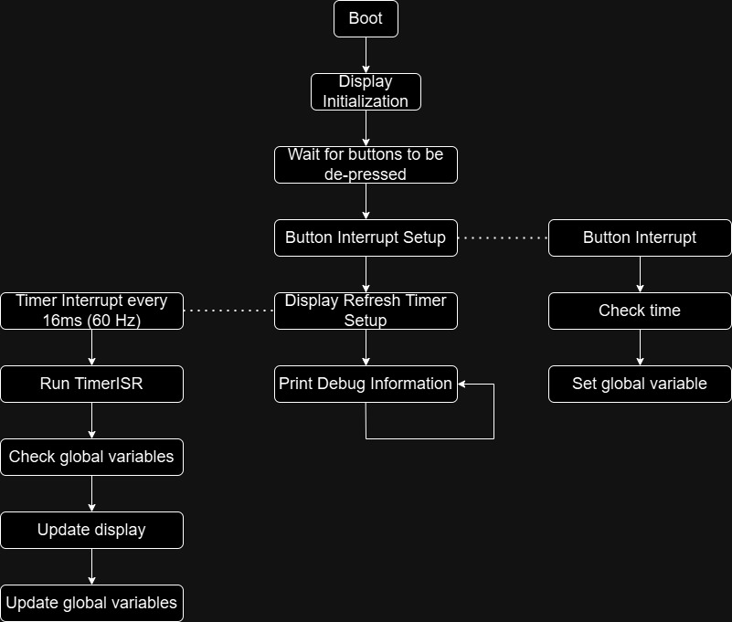

# 2.007 Spring 2024 Gameboard - Button Display

This firmware is for the button displays on the 2.007 Spring 2024 gameboard. 

The device has 4 button inputs that robots can interact with. These buttons must be pressed in a specific sequence to earn points. The button presses are tracked on the display and shown. 

One of the major changes in this firmware compared to most other code one might encounter is that everything is implemented in timer and interrupt peripherals. This means that the flow of the code is quite different from what most people learn when they first start writing code. [Here's a link](https://users.ece.utexas.edu/~valvano/Volume1/E-Book/C12_Interrupts.htm) to learn about interrupts.

Flowchart for the firmware

The central flow diagram is what is typically taught in code structure. Here, initialization and setup code (usually in `void setup(){}`) is run once and code that repeats is run in a loop (usually in `void loop(){}`). What is special is the two other flow structures on the left and right. They get initialized in setup. For the button interrupt, it's initialized as a pin-change interrupt. This means that if the state of the pin changes, a function is called instantaneously without requiring constant polling. It's initialized in this line:

> `attachInterrupt(digitalPinToInterrupt(BUTTON_INPUT_1), ButtonInterruptFunction1, RISING);`

`digitalPinToInterrupt` converts a pin to an interrupt, and `ButtonInterruptFunction1` is the function called when the pin changes, in this case, when the pin rises. The function that's called when an interrupt happens is typically called an Interrupt Service Routine (ISR) since responding to an interrupt is referred to as servicing the interrupt. See [here](https://docs.arduino.cc/language-reference/en/functions/external-interrupts/digitalPinToInterrupt/) for further documentation. 

Four of these interrupts are set up to account for the four buttons that are connected. They set a global variable to the time that the button is pressed. It's good practice to make the ISR is as short as possible since it brings the microcontroller away from the main loop. Specifically, millis() is on a 1 millisecond timer interrupt to update the runtime. Arduino tends to get very unhappy and crashes when another ISR takes long enough to block millis() from running. For this reason, it's advisible that interrupts only set variables and not include waits. `Serial.print` functions typically also take too long that it's not recommended to use them in ISRs.

Timers can also trigger interrupts! Timer setups are a lot more hardware-dependent, so refer to the [ESP32 Arduino Framework documentation](https://espressif-docs.readthedocs-hosted.com/projects/arduino-esp32/en/latest/api/timer.html) on how to set up a timer. The timer in this case is set up to interrupt every 16ms, which equiates to about 60 Hz. Once the timer expires, `timerISR` is called, which updates the display. For more specific documentation on all the functions used to draw images to displays, see the dependent [ESP32-HUB75-MatrixPanel-DMA library](https://github.com/mrcodetastic/ESP32-HUB75-MatrixPanel-DMA).

For bitmaps, the `drawXBM565` function is called. This pulls a bitmap array from memory to draw it on the display. There's more documentation on this [here in the examples](https://github.com/mrcodetastic/ESP32-HUB75-MatrixPanel-DMA/tree/master/examples/BitmapIcons). In this firmware, all the image assets are saved in `ImageAssets.h` to clear up space in the main firmware file.

`LEDMatrixConfig.h` is used to define pins for various board revisions. It shouldn't need to be modified unless a new board revision is designed. 

