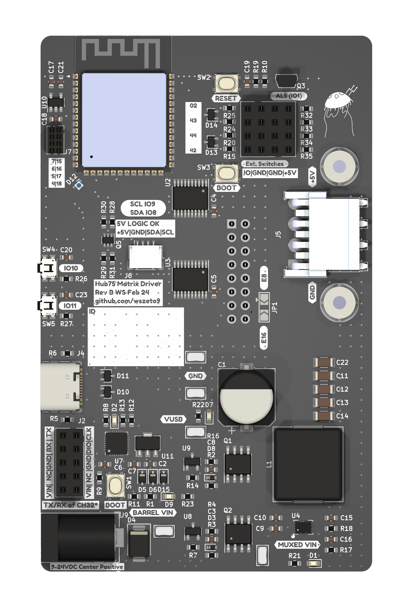

# ESP32-S3-HUB75-Driver

This board serves as the Matrix Display driver for MIT's 2.007 gameboards in Spring 2024 and Spring 2025. The board can take 4 button inputs, Stemma-QT I2C sensors, and breaks out 8 GPIO pins for future use. The board also features a ambient light sensor to adjust brightness in real time, as well as two buttons to switch modes if needed. The board supports USB-C PD power input up to 20V and USB debugging, as well as a 5.5mm OD / 2.1mm ID barrel jack for 9-24V input. A 5V/6A Buck converter helps ensure that the display is adequately powered. For this reason, it's recommended to power the display off a source higher than 5V for long term purposes. 

The board contains a power mux that automatically switches power sources based on what's present. It will always choose the first power source that's provided. If debugging is desired, it's recommended to first plug in the barrel jack for power, then use the USB port for debugging. This ensures lower power draw from the host computer. 

Upon power up, D7 or D9 will light up based on what power source is present. D2 should blink in accordance to the voltage of the power source (ie 5 blinks is a 5V source). D1 indicates that power is properly being delivered to the converter. 

At this point, the ESP32-S3 should pop up as a virtual COM port over USB. Boot and reset buttons are located by the ESP, but they may not be needed to perform DFU. 

Note: E8 and E16 refer to the pin that is used to act as pin E. This is only present on 64x64 pixel displays and larger. Some displays use pin 8, some displays use pin 16. Adafruit claims they use pin 8 for address E, so use a solder blob to jump the jumper to E8.

Further documentation can be found under the specific firmware builds. 
 
